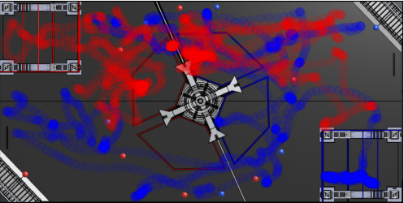

# Match Viewer
match viewer allows the user to see:

- every match pladed in a compitions for one team
- compare teams in some or all matches
- compare performance on both sides red or blue

## The what can it be used for?
the main usage that was intened for this porgram was to be used in match stratagey. Like to fined commen paths that the driver like to take or spots that they like to sit.

---
# How to use
## Requirments
Befor you use this program you need to install the fallowing:
```
python3,
numpy,
matplotlib
```

## Installation
> ### Installing Python3
> To install python3 go to [click here](https://www.python.org/downloads/) to go to the download page an fallow the instructions there.

> ### installing Numpy
> to install numpy go to your tuminal or command propmt and type in this command.
> ```
>  python3 -m pip install numpy
> ```
> this will download numpy on your computer.

> ### installing MatPlotLib
> To install MatPlotLib will be performed the same way as **Numpy** just run this command in the terminal.
> ```
> python3 -m pip install matplotlib
> ```
> after running this command you would have installed MatplotLib on your computer.

---
# Commands
Here are the main commands for *Match Viewer*.

To start the program you need to run:
```
python3 matchv.py
```
But to achuly make it work you need to give it some commands.

> the first command that you need to run is: ```python3 matchv.py -u``` this will grab all of the data the is spesifid in the config file.
```shell
python3 matchv.py -t "red/frc3663"
```
this would compile all matches pladed in the compitition from the comfig file so it would look like this.


```shell
python3 matchv.py -m "2022pncmp_qm34"
```
this will show you the wholl match and where every one was at


```shell
python3 matchv.py -mt "2022pncmp_qm34" "blue/frc3663"
```
If you want to single out a team or teams you can just use the `-mt` command with the match and the team.


One can also compare two or more teams in the same match.
```shell
python3 matchv.py -mt "2022pncmp_qm34" "blue/frc3663 red/frc7461"
```



