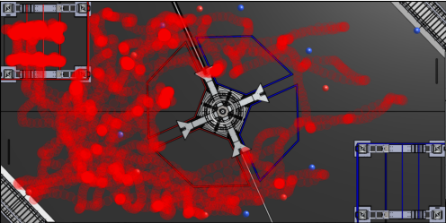
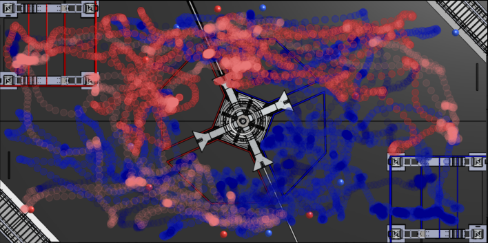
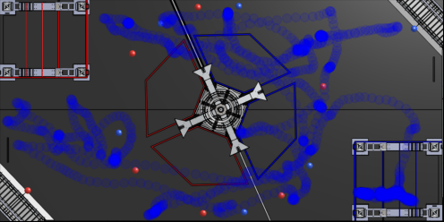
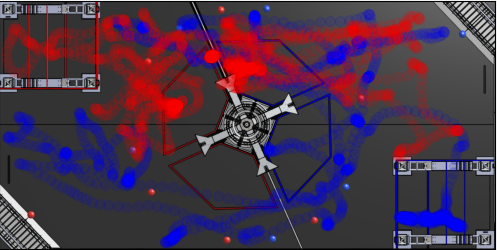

# Match Viewer
Match Viewer allows the user to see:

- The data from one or multiple teams in a competition
- Compare teams in some or all matches
- Compare performance on both sides for Red or Blue Alliance

## The "What can it be Used For"?
The main purpose of this program is to be used in match stratagey, providing teams with valuable data. For example, finding common paths that the driver likes to take, or spots that they like to sit.

---
# How to Use
## Requirements
Before you use this program, you need to install the following:
```
python3,
numpy,
matplotlib
```

## Installation
> ### Installing Python3
> To install python3, go to [here](https://www.python.org/downloads/) for the download page. Follow the instructions there.

> ### Installing Numpy
> To install numpy, go to your terminal or command propmt, and type in this command:
> ```
>  python3 -m pip install numpy
> ```
> This will download numpy on to your system.

> ### Installing MatPlotLib
> To install MatPlotLib, the same procedure will be performed for installing **Numpy**. Just run the following command in the terminal:
> ```
> python3 -m pip install matplotlib
> ```
> After running this command you will have installed MatplotLib on your system.

---
# Commands
Here are the main commands for *Match Viewer*.


> The first command that you need to run is: ```python3 matchv.py -u```. This will grab all specified data from the config file.
```shell
python3 matchv.py -t "red/frc3663"
```
This will compile all matches played in the competition from the config file. It will look like this.


```shell
python3 matchv.py -m "2022pncmp_qm34"
```
This command will show you positional data for the whole match. 



```shell
python3 matchv.py -mt "2022pncmp_qm34" "blue/frc3663"
```
If you want to single out a team or teams, you can just use the `-mt` command with the match and the team.



One can also compare two or more teams in the same match.
```shell
python3 matchv.py -mt "2022pncmp_qm34" "blue/frc3663 red/frc7461"
```



